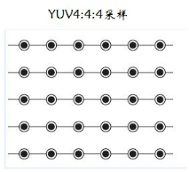
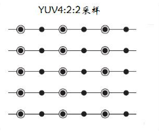
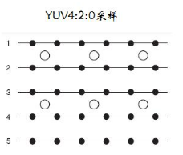

### yuv420p学习
- `将jpg转换为yuv420p的ffmpeg命令`
```
ffmpeg -i a.jpg -s 1920*1200 -pix_fmt yuvj420p a.yuv
```

- `将jpg转换为yuyv的ffmpeg命令`
```
ffmpeg -i a.jpg -s 1920*1200 -pix_fmt yuyv422 yuyv.yuv
```

```
yuv的查看工具,网上下载的7yuv工具.
```

- `查看`
```
ffplay.exe -f rawvideo -pixel_format yuv422p -video_size 1920x1080 .\yuv422p.yuv
```

- `yuv2jpg`
```
ffmpeg -y -s 960x540 -pix_fmt yuv422p -i yuv422p_output.yuv yuv422p_output.jpg
```

- `note`
```
暂时只支持YUV422P
```

- YUV444
```
Y U V分量比例为1:1:1
一个像素大小 = 1 + 1 + 1 = 3字节
```


- YUV422
```
水平采样，不垂直采样
每两个像素点Y分量共用一组UV分量
即每两个像素大小 = Y + Y + UV = (1+1+1*2) = 4字节
每个像素大小 = 4/2 = 2字节
```


- YUV420
```
水平采样，垂直采样
每四个像素点Y分量共用一组UV分量
即每四个像素大小 = Y + Y + Y + Y + UV = (1+1+1+1+1*2) = 6字节
每个像素大小 = 6/4 = 1.5字节
```


[YUV420格式解析](http://blog.chinaunix.net/uid-25272011-id-3430329.html)

[详解YUV系列（三）----YUV420](https://blog.51cto.com/u_7335580/2060931) 

[详解YUV420数据格式](http://t.zoukankan.com/samaritan-p-YUV.html)

- YUV2RGB
```
Y = 0.257R + 0.504G + 0.098B + 16
Cb= -0.148R - 0.291G + 0.439B + 128
Cr= 0.439R - 0.368G - 0.071B + 128

R = 1.164(Y-16) + 1.596*(Cr-128)
G = 1.164*(Y-16) - 0.813*(Cr-128) - 0.392*(Cb-128)
B = 1.164*(Y-16) + 2.017*(Cb-128)
```

- RGB颜色值
```
白色：rgb(255,255,255)
黑色：rgb(0,0,0)
红色：rgb(255,0,0)
绿色：rgb(0,255,0)
蓝色：rgb(0,0,255)
青色：rgb(0,255,255)
紫色：rgb(255,0,255)
```

- YUV 黑色
```
y = 16
u = 128
v = 128
```