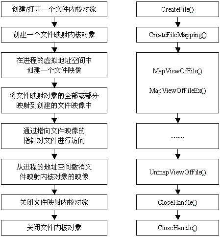

### Windows进程间的通信

### 进程间通信方式
1. 文件映射
- 使用内存映射文件的一般流程
```
1. CreateFile()
2. CreateFileMapping()
3. MapViewOfFile()
4. MapViewOfFileEx()
5. 
6. UnmapViewOfFile()
7. CloseHandle()
8. CloseHandle()
```


2. 共享内存