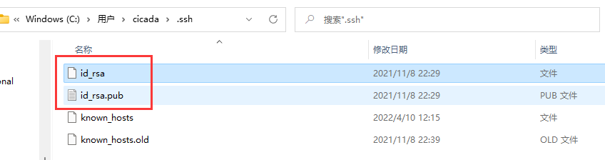
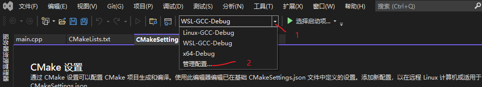

### Linux C/C++调试

- `简要`
```
1. 本文使用如下代码进行演示TestMediaDetect
2. 测试环境win11 wsl2 vs2022
3. gdb调试，vs远程调试Linux
```

#### `准备工作`

- `下载代码`
```
git clone https://github.com/LoveCicada/test.git

1. 下载代码优先在Linux环境下下载，由于Windows与Linux处理换行的方式不同，CRLF与LF的差异，会导致Linux脚本中无法正常使用。
2. 本例仅使用仓库代码中的TestMediaDetect。进入TestMediaDetect所在目录。
cd test/work/TestMediaDetect
如果想简要了解该代码，可以查看目录下的ReadMe.md文档
```


- `测试代码编译`
```
执行脚本 ./build.sh
完成cmake及make

如果需要调试，则执行./build-Debug.sh生成带调试文件的可执行程序及动态库
```


- `build.sh`
```
#! /bin/bash

clear
echo "create build dir"
mkdir build
cd build
rm -rf ./*
cmake ..
make -j4
cd ..
```

- `build-Debug.sh`
```
#! /bin/bash

clear
echo "create build dir"
mkdir build
cd build
rm -rf ./*
cmake ..  -DCMAKE_BUILD_TYPE=Debug
make -j4
cd ..
```

- `cmake注意细节`
```
1. 一般为了避免生成的中间文件或者目标文件混杂在当前代码目录文件中，
因此常新建一个文件build，文件夹命名任意。然后进入此文件夹内部进行cmake。
上述的cmake ..中的".."代表的含义是上一级目录，
因为本例的cmakelists.txt文件在build上一级目录中。
2. -DCMAKE_BUILD_TYPE=Debug含义是指定编译生成的库类型为debug库，一般默认是生成release库。
3. 区分debug库及release库，简单的区分原则是看生成的库大小，质量大的则为debug库。
4. cmakelists.txt内部定义了输出目标路径。release库生成在Release目录下，
debug库生成在Debug目录下。
5. 具体可查看cmakelists.txt及嵌套的cmakelists.txt子文件
```

- `检查编译结果`
```
进入Release目录，查看是否有生成的可执行文件app及动态库libCXEMediaDetect.so
cd Release/
```


- `查看依赖情况`
```
在Release目录下，运用ldd查看依赖情况
如果并没有提示依赖库not found，则表明程序运行依赖正常
ldd app
ldd libCXEMediaDetect.so
```


- `测试代码运行`
```
在Release目录下，运行程序app，如果运行结果中打印出load lib success，则代表编译的库运行正常。
下图所示的ERROR信息，是因为libCXEMediaDetect.so依赖的库libVXCutlistV2Plus.so还需要依赖其他库。本文档仅演示调试，可忽略该错误。
./app
```


#### gdb调试

- `准备debug库`
```
执行上述./build-Debug.sh脚本，生成debug库
```

- `gdb基本调试`

[gdb常用调试](https://github.com/LoveCicada/test/blob/master/gdb/gdb调试.md)

- `调试`
```
gdb -tui，添加参数-tui代码可以可视化看到代码。如果不添加-tui，那么则不会显示代码。
如下图所示
1. 添加断点 b main，在main函数中添加断点
2. 设置main函数入口参数，set args /mnt/d/file/video/ouran.mp4
```


- `开始调试`
```
输入r程序继续运行, n代表继续执行下一步。按enter回车键代表继续上一次执行的命令，例如上一次输入的是n，那么此时敲回车，是继续执行n命令。
s代表进入函数调用堆栈。
```


- `gdb调试总结`
```
在Linux下开发，掌握gdb调试是必要的，选择了Linux开发，那么就要强迫自己接受命令行终端交互。gdb调试功能很强大，上述教程仅作为引导入门。
```

#### vs远程调试

- `简要`
```
使用vs远程调试Linux环境下的cmake工程，主要实现方式是，vs远程连接上Linux环境，将Linux环境上相关的库拷贝到本地Windows环境，
调试时使用Linux的gdb来进行调试。微软封装了界面UI使用，
因此可以通过可视化点击界面来进行调试。
```

- `准备工作`
```
1. 代码。将TestMediaDetect文件夹拷贝到本地Windows环境D:\code\work\test目录下
2. 用vs右键打开TestMediaDetect
3. 尽量选用vs2019版本及其以上版本。从vs2019版本开始，微软对于cmake工程使用支持更好，及远程Linux调试更好。本教程是在vs2022版本上进行测试。QAQ
4. 本例使用的Linux环境是win11上的wsl2子系统，系统版本是Ubuntu22.0
```

- `遇到的坑`
```
加载CMakeSettings.json时，提示"正在等待intelliSense 完成初始化"。
要么安装Incredibuild使用，需要加载license，或者禁用卸载掉。 
```

- `ssh连接`
```
可参考如何向git-hub远程仓库提交代码部署ssh。
1. 需要在windows机器及Linux机器部署ssh，生成一对公钥-密钥对。
2. 然后将本地的公钥添加到Linux机器上。
3. Windows上默认生成的密钥-公钥所在路径是 C:\Users\某用户\.ssh。
```

```
4. Linux上默认生成的密钥-公钥所在路径是 ~/.ssh
生成密钥对：ssh-keygen -A
```


```
5. id_rsa.pub是公钥文件，id_rsa是私钥文件。
```



```
6. 在Linux机器路径~/.ssh下，新建文件authorized_keys，将需要连接的其他机器的公钥文件内部拷贝到内部。
例如本例将某Windows机器中id_rsa.pub内容拷贝进文件authorized_keys。
```


```
7. 开启ssh服务，sudo service ssh start
```


```
8. 重启ssh服务，sudo service ssh start
```


- `测试ssh连接`
```
1. 查看Linux机器ip，ifconfig
```


```
2. ssh连接，ssh dyf@172.20.231.9。
如遇到"Are you sure you want to continue connecting (yes/no/[fingerprint])?"，输入yes即可，存储远程Linux机器密钥指纹。
```


- `wsl2与Linux环境部署vs远程调试的差异`
```
1. CMakeSettings.json配置文件的差异
2. 连接的差异
```

##### WSL2环境
```
1. wsl2环境中，Windows本机上盘符会自动挂载wsl2下。及/mnt/路径下可查看C盘，D盘等其他盘符。
```


```
2. 右键用vs studio打开含有cmakelists.txt的文件夹。本例打开的是TestMediaDetect文件夹。
```


```
3. 增加管理配置，设置调试信息。CMake如何设置，可参考微软官网更详细的文档。设置的结果都记录在CMakeSetting.json文件中。
```


```
4. 点击CMake设置界面的增加按钮，在弹窗中选择WSL-GCC-Debug
```


```
5. 在CMake设置界面中，选择配置类型为Debug，工具集选择Linux_x64，依据远程的Linux机器安装的系统。
点开高级设置，CMake生成器选择Unix Makefiles。
然后选择保存CMake设置。其他参数设置可以暂时按默认值设置，
或者详细查看具体参数设置，结合项目本身需要再进行设置。
```


```
6. 保存好设置后，切换到设置的WSL-GCC-Debug配置，然后在vs中打开CMakeLists.txt文件，会提示cmake生成，
点击生成，vs即开始自动读取cmakelists.txt文件开始构建编译工程。
如果没有自动构建cmake工程，则可以手动构建。点击菜单栏-项目-配置缓存，构建项目。
```


```
7. cmake编译完成后，即可选择需要调试的程序，然后开始调试。
```


##### Linux环境
```
部署调试远程Linux配置，与上述调试WSL2环境配置，大同小异。即参考上述配置。
其他配置可按默认参数配置即可。
1. 需要添加远程机器的登录方式。
打开调试-选项-跨平台-连接管理器，添加远程机器的登录方式，输入访问IP，登录用户名及密码。
```
  
     

```
2. 添加CMake设置
选择菜单栏项目-->CMake设置
```
 

```
3. 选择调试类型
Linux-GCC-Debug
```
 

```
4. 在CMake设置中，找到远程计算机名称，在下拉列表中找到刚才新增的远程账户登录信息。
```
 

```
5. 完成基础的CMake设置后
如果没有自动加载构建CMake工程，可选择菜单栏项目，然后选择配置缓存，
vs会立即重新构建工程。
```
 

```
6. 调试
工程构建完毕后，可选择需要调试的程序，然后在代码中打上断点，开始调试
```
 


#### vs加载Linux远程进程调试
- `SSH远程连接`
```
1. 选中菜单栏中调试选项，再选择附加到进程
```
 

```
2. 选择SSH
```
 

```
3. 输入IP及用户名/密码
```
 

```
4. 接受主机密钥
```
 

```
5. 搜索需要调试的进程
```
 

```
6. 选择附加进程，勾选Native(GDB), 点击确定
```


```
6. 如果有弹窗error提示。
operate permission problem
ubuntu attach失败
```


```
7. 解决方式
在远程Linux机器上输入如下命令，命令正常响应后，
再按上述步骤进行vs远程ssh连接
echo 0 | sudo tee /proc/sys/kernel/yama/ptrace_scope
```

```
8. 查看Linux调试程序加载的动态库
此时，已代表vs attach上远程Linux程序，拖入代码到vs中，即可打断点调试。
或者重新用vs打开代码文件夹，再按上述步骤进行attach也行。
```


- `总结`
```
搭建环境时，可能会遇到如下问题：
1. 连接问题。ssh服务一定要开启，本地机器的公钥需要添加到远程机器上。
2. 新手建议选择通过CMake设置界面配置选项，不建议直接操作CMakeSetting.json。
3. cmakelists.txt与CMakeSeting.json详细配置，可参考官方文档。
```