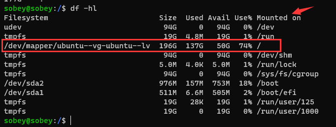
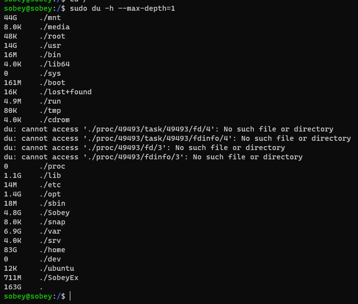
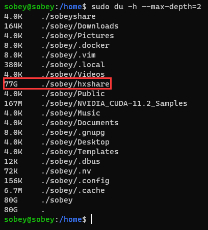

### 查看盘符大小

- 主要使用命令

#### 查看Linux目录剩余空间大小，以及查看挂载信息
```
df -hl
```


```
解读：
从上图，查找/dev/mapper/ubuntu--vg-ubuntu--lv路径，
其实是挂载在目录：/ 下面
因此需要定位/目录下查看当前目录及子目录大小
cd /
```

#### 查看所在目录及子目录所占空间大小
```
du -h --max-depth=0

# depth=0 代表当前一级目录
# depth=1 代表当前一级目录及二级目录
同理
```



```
从上图，定位到占用空间比较大的盘符是
/mnt
/home
因此需要进入/home下面，继续执行du -h --max-depth=1
```

