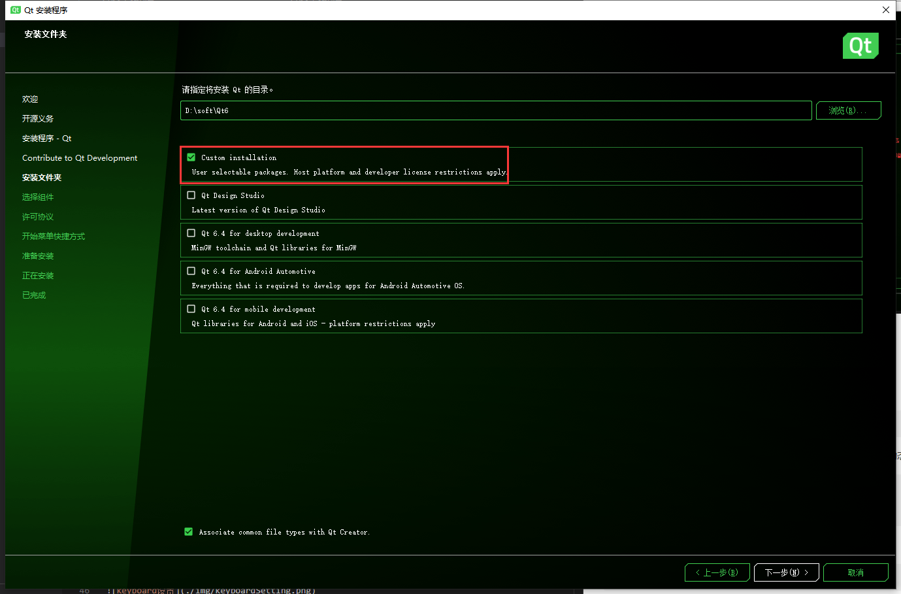
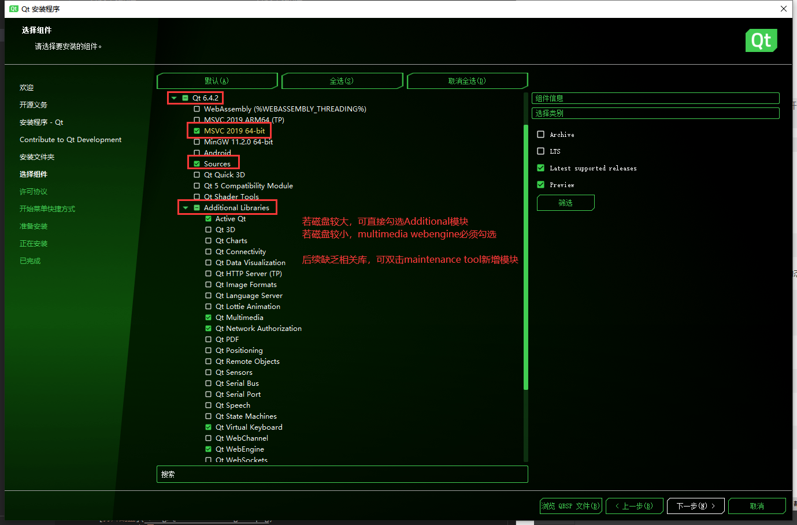
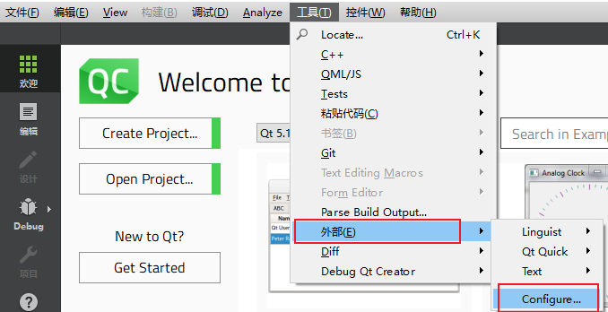
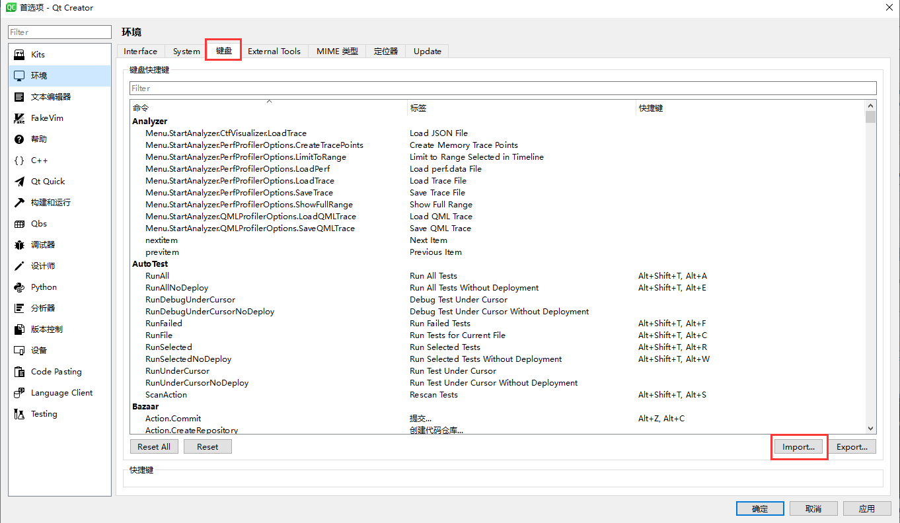
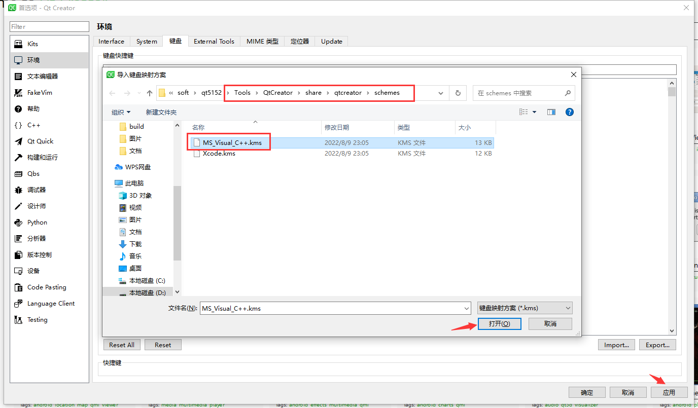

[TOC]

### MAC


#### C++ 开发环境搭建

[QT 安装](https://iso.mirrors.ustc.edu.cn/qtproject/archive/online_installers/4.5/qt-unified-macOS-x64-4.5.0-online.dmg)

> 选择安装Qt5.15.2版本，提前注册好QT官网账号，或者在打开安装程序后，断开网络连接跳过账号登陆验证。

- Qt6.4.2版本安装

[Qt6.4.2 - Windows下载路径](https://mirrors.tuna.tsinghua.edu.cn/qt/archive/online_installers/4.5/qt-unified-windows-x64-4.5.1-online.exe)

`Mac下, 例如M1, arm架构的机器下安装Qt6.4.2, 默认安装的是arm架构版本`

`Mac下, inter架构的机器下安装Qt6.4.2, 默认安装的是x86_64架构版本`

`Mac下, 例如M1, arm架构的机器下安装Qt5.15.2, 默认安装的是x86_64架构版本, 如果需要arm架构版本，需要arm版本, 则需要手动编译源码生成arm版本`

[Qt6.4.2 - Mac下载路径](https://mirrors.tuna.tsinghua.edu.cn/qt/archive/online_installers/4.5/qt-unified-macOS-x64-4.5.1-online.dmg)

[Qt6.4.2 - Linux下载路径](https://mirrors.tuna.tsinghua.edu.cn/qt/archive/online_installers/4.5/qt-unified-linux-x64-4.5.1-online.run)




- 环境变量设置预备知识了解
```bash
1. Mac下默认的shell是zsh, 而不是bash
2. 因此, 如果想要环境变量完全生效, 则需要依据你当前使用的shell修改
3. 如果是zsh, 则对应的环境配置文件是~/.zprofile
4. 如果是bash, 则对应的环境配置文件是~/.bash_profile
5. 修改环境变量后, 想要立即生效, 则可以通过source命令更新, 例如`source ~/.zprofile`
6. 重启之后, 也可生效
 
7. 如果只通过Qt Creator调试启动程序, 可以不用配置Qt的环境变量
```

- Qt环境配置

[Qt安装后配置环境变量（Mac）](http://t.zoukankan.com/goodboy-heyang-p-4793459.html)

- 编辑环境配置文件 bash
```bash
sudo vim ~/.bash_profile
```
- 添加环境变量文件内容，将Qt动态库及可执行程序添加到动态库环境变量及可执行程序环境变量中
```bash
export QTDIR=/Users/sobey/Qt/5.15.2/clang_64
export LD_LIBRARY_PATH=$LD_LIBRARY_PATH:$QTDIR/lib
export PATH=$PATH:$QTDIR/bin
```

- 使环境变量立即生效
```bash
source ~/.bash_profile
```

- 编辑环境配置文件 zsh
```bash
sudo vim ~/.zprofile
```
- 添加环境变量文件内容，将Qt动态库及可执行程序添加到动态库环境变量及可执行程序环境变量中
```bash
export QTDIR=/Users/sobey/Qt/5.15.2/clang_64
export LD_LIBRARY_PATH=$LD_LIBRARY_PATH:$QTDIR/lib
export PATH=$PATH:$QTDIR/bin
```

- 使环境变量立即生效
```bash
source ~/.zprofile
```


- 测试qmake环境配置是否正常 
```bash
qmake -v
```

#### 配置QtCreator键盘快捷键






#### 常用开发软件安装
- vscode

[vscode下载](https://code.visualstudio.com/docs/?dv=osx)

[设置vscode在命令行中启动](https://blog.csdn.net/hbysj/article/details/122615364)


``` vscode 常用插件安装
Chinese (Simplified)(简体中文)

Markdown All in One
Markdown Preview Enhanced

git graph
git history
git blame

C/C++
```

- brew
```bash
/bin/zsh -c "$(curl -fsSL https://gitee.com/cunkai/HomebrewCN/raw/master/Homebrew.sh)"
```
[Mac终端： brew command not found 解决方法](https://blog.csdn.net/weixin_43822632/article/details/110472605)

执行上述脚本命令时，会提示安装git，参考上述文章操作即可

- xcode

App store中搜索xcode 安装


#### 代码管理工具下载
- git
```
brew install git
```

- git gui工具下载
[git-gui](https://git-scm.com/download/gui/mac)

推荐使用[source tree](https://www.sourcetreeapp.com/)


#### 代码下载
```bash
git clone http://192.168.252.34/mx-team/metaxcreator.git
```

#### git下载代码可能遇到的问题

1. it-lfs filter-process: git-lfs: command not found
```bash
brew install git-lfs
```

2. Mac Homebrew命令报错/usr/local/Homebrew/Library/Homebrew
```bash
brew update-reset
```

3. 执行brew update-reset失败
```bash
brew update
```

4. 执行brew update失败
```
git -C /usr/local/Homebrew/Library/Taps/homebrew/homebrew-cask fetch --unshallow
```

5. Mac安装 git-lfs 出现 Command failed with exit 128: git
```bash
brew -v
git config --global --add ...
```
[Mac安装 git-lfs 出现 Command failed with exit 128: git](https://copyfuture.com/blogs-details/202211030321578817)


#### 代码编译
1. 打开QtCreator，打开项目pro所在目录`/metaxcreator/solution/qt`，选中`MetaXEditor.pro`

2. freetype库依赖了libpng库，目前可先通过命令安装libpng库，后续考虑将libpng库拷贝到depend目录下
- 安装libpng
```bash
brew install libpng
```

#### 常见问题处理
- doc

[Macos下Qt Creator运行项目提示启动失败解决方案](https://blog.csdn.net/haojingus/article/details/122882906)

[mac 关闭 f11 显示桌面快捷键](https://blog.csdn.net/ea8d1n3/article/details/125215120)


### mac 开发问题
- macOS objc_msgSend

[macOS objc_msgSend](https://blog.csdn.net/luoshabugui/article/details/108579532)

### 第三方库编译

#### armx64, 在arm架构的机器上编译

##### log4cpp
- log4cpp 源码编译
```bash
./configure
make
make check
mkdir installDest
make install prefix=$PWD/installDest
```
>> 生成的库lib及头文件存放在installDest目录下; 直接运行make install，则会安装在系统路径下/usr/lib, /usr/include

- log4cpp vcpkg编译

#####  freetype
- vcpkg安装
```bash
./vcpkg install freetype:arm64-osx
```
vcpkg本地暂未安装成功，可能是由于访问外网问题

```bash
brew install freetype
brew info freetype
```


##### zlib
- zlib 源码编译
```bash
./configure
make -j4
```

##### lunasvg

- lunasvg源码编译
```bash
tar -zxvf lunasvg.tar.gz
mkdir build
cd build
cmake ..
make -j4
```

##### FreeImage

- FreeImage
```bash
vcpkg install FreeImage
```

在MAC arm架构的机器上编译，需要使用brew编译，能够成功；
成功以后通过info命令获取include lib文件，然后再拷贝到非编指定目录下
```
brew install FreeImage
brew info FreeImage
```

### MAC 下查看文件的RPATH 

- 查看文件的RPATH列表

```bash
otool -l testing.1.dylib | grep RPATH -A2 
```

- 查看文件RPATH安装路径

```bash
otool -L testing.1.dylib
```

- install_name_tool用法案例

```bash
install_name_tool [-change old new] ... [-rpath old new] ... [-add_rpath new] ... [-delete_rpath old] ... [-id name] input
```

- install_name_tool修改rpath用法

```bash
install_name_tool [-change old new] input
```

- 添加rpath

```bash
install_name_tool -add_rpath @loader_path/ testing.1.dylib
```

- 修改rpath

```bash
install_name_tool -change old/dylib/path.dylib new/dylib/path.dylib testing.1.dylib
```

### Mac查看库的架构版本

- lipo

```bash
lipo -info testing.1.dylib

lipo -info libfreeimage.a
Non-fat file: libfreeimage.a is architecture: x86_64
```

- lldb

```bash
lldb testing.1.dylib

lldb libfreeimage.a
(lldb) target create "libfreeimage.a"
Current executable set to '/Users/xxx/demo/FreeImage/Dist/libfreeimage.a' (x86_64).
(lldb) q
```
