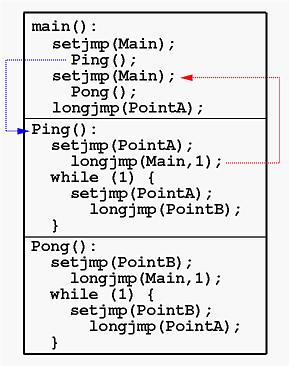
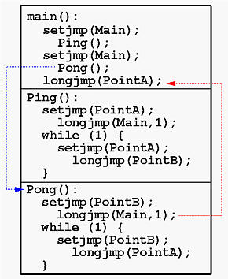
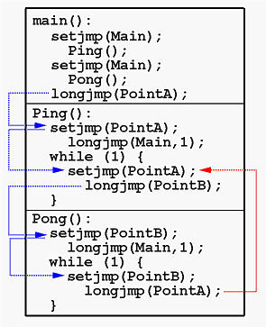
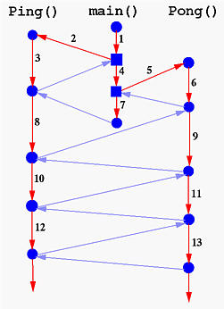

#### setjmp and longjmp

- `setjmp`

> 1.setjmp()设置"jump"点，用正确的程序上下文填充jmp_buf对象j。这个上下文包括程序存放位置，栈和框架指针，其他重要的寄存器和内存数据。当初始化完jmpbuf的上下文，setjmp返回0值。  

> 2.以后调用longjmp(j, r)的效果就是一个非局部的goto或"长跳转"到由描述的上下文处(也就是到原来设置的setjmp()处)。当作为长跳转的目标而被调用时，**setjmp()返回r或1(如果r设为0的话)**。(setjmp()不能在这种情况时返回0。)

通过有两类返回值，setjmp()让你知道它正在被怎么使用。当设置时，setjmp()如你期望地执行；但作为长跳转的目标时，setjmp()就从外面"唤醒"它的上下文。你可以用longjmp()来终止异常，用setjmp()标记相应的异常处理程序。

***

- `st.c 解析`
> 1.主程序看起来很简单。第一个setjmp()将当前状态保存到跳转缓冲区Main中。然后，主程序调用函数Ping()。
一旦执行进入函数Ping()，就会设置跳转缓冲区 PointA，然后立即将控制权返回给主程序。

    

> 2.通过长跳从Ping()返回后，主程序对函数Pong()执行相同的操作。函数Pong()建立一个跳转缓冲区PointB并使用长跳转回到主缓冲区。

    

> 3.回到主程序。下一条要执行的语句是longjmp(PointA,1)。即 主程序使用长跳转进入函数 Ping()

> 4.在函数Ping()中，由于这是从跳远中返回的，因此控制失败并执行while循环。在此循环的每次迭代中，都会将新状态保存到跳转缓冲区PointA中，并覆盖前一个状态。保存此状态（或标记返回点）后，函数 Ping()执行长跳转到PointB，这是由函数Pong()标记的点。更准确地说，函数 Ping( )通过跳远而不是调用 进入函数Pong() ！
函数Pong()遵循我们刚才提到的内容。也就是说，执行失败并进入while循环。在这个循环中，一个新的状态被保存到跳转缓冲区PointB 并长跳转回Ping()。

    

> 5.因此，函数Ping()使用长跳转到函数 Pong()的PointB。然后，函数Pong()还使用一个跳远函数进入函数Ping()的 PointA。这种交替执行（在函数 Ping()和Pong()之间）一直持续到函数 Pong()执行了 max_iteration次。

> 6.下图显示了控制流程。蓝色方块表示函数调用，红色箭头是程序执行流，浅蓝色箭头是使用 setjmp()和longjmp()生成的控制流。箭头旁边的数字给出了该事件的顺序。

    

在多线程系统中，我们可能有许多作为线程运行的函数，每个函数在运行时堆栈中都有一个环境。线程调度器只是使用类似于上述程序的技术来调度就绪队列中的那些线程。

***

