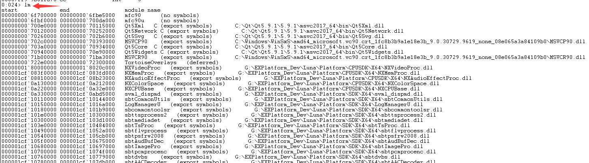
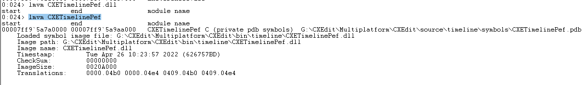

### windbg 调试

### `windbg调试进程`
####  添加pdb路径


#### 添加程序源码路径


#### attach程序


#### 设置断点


#### 程序往下执行


#### 程序中断


#### detach程序


#### 查看加载/未加载的dll
```
lm
```


#### 查看指定dll加载情况
```
lmvm CXETimelinePef
lmvm命令可以查看任意一个已加载的DLL/EXE的详细信息，以及symbol的情况, 
特别提醒的是，不要加后缀名（无论EXE/DLL）
```
